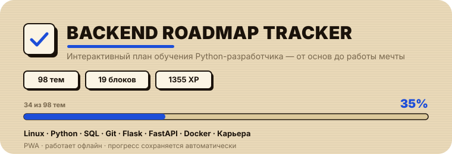
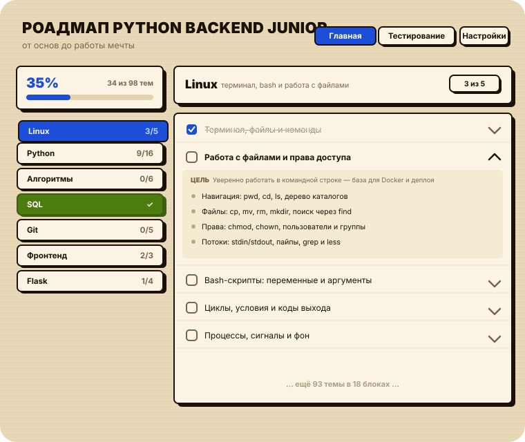

<p align="center">
  
</p>

<p align="center">
  <b>Интерактивный план обучения Python-разработчика</b> —
  трекер прогресса с фазами, темами и офлайн-режимом.
</p>

<p align="center">
  <a href="https://danekemik.github.io/RoadMap-Tracker/">🌐 Открыть трекер</a>
</p>

---

## 📸 Что внутри

<p align="center">
  
</p>

Персональный роадмап на 4 месяца: от терминала и основ Python до FastAPI, Docker и трудоустройства. Отмечайте изученные темы — прогресс сохраняется автоматически и работает без интернета.

## ✨ Возможности

- **98 тем по 4 фазам**: Python → SQL/Git/Flask → FastAPI → Карьера
- **Прогресс-панель**: общий процент, счётчик изученного и статистика по блокам
- **Подтемы внутри дня**: отмечайте пункты, а не только тему целиком
- **Автосохранение** в `localStorage` — прогресс не пропадёт
- **PWA**: устанавливается на телефон/ПК и работает офлайн
- **Тёмная тема** с анимациями и «шёрстяным» прогресс-баром

## 🗺 Фазы обучения

| Фаза | Содержание | Тем |
|------|------------|:---:|
| 0 · Python | Python углублённо + алгоритмы | 16 |
| 1 · Семестр | SQL, Git, веб, Flask | 27 |
| 2 · FastAPI + инструменты | FastAPI, тесты, Docker, безопасность, очереди | 46 |
| 3 · Карьера | Резюме, собеседования, трудоустройство | 9 |

## 🚀 Запуск локально

```bash
git clone https://github.com/danekemik/RoadMap-Tracker.git
cd RoadMap-Tracker
python3 -m http.server 8317
# откройте http://localhost:8317
```

На macOS можно просто дважды кликнуть на `Роадмап.command` — он сам поднимет сервер и откроет браузер.

## 🛠 Технологии

- **Фронтенд**: чистый HTML + CSS + JavaScript, без фреймворков
- **Сборка данных**: Python (`generator/build.py`) собирает `data.js` из модулей `days_*.py`
- **PWA**: Service Worker + Web App Manifest

## 📁 Структура

```
├── index.html          # интерфейс приложения
├── data.js             # сгенерированная программа обучения (98 тем)
├── manifest.json       # PWA-манифест
├── sw.js               # service worker (офлайн-режим)
├── icons/              # иконки приложения
├── assets/             # иллюстрации для README
└── generator/          # python-сборщик данных
    ├── build.py
    └── days_p0..p4.py
```

## 🔄 Обновление данных

Данные собираются из Python-модулей:

```bash
cd generator && python3 build.py
```

Скрипт объединяет все темы, перенумеровывает дни и недели, рассчитывает время на каждую тему и записывает обновлённый `data.js`.

## 📄 Лицензия

MIT © danekemik